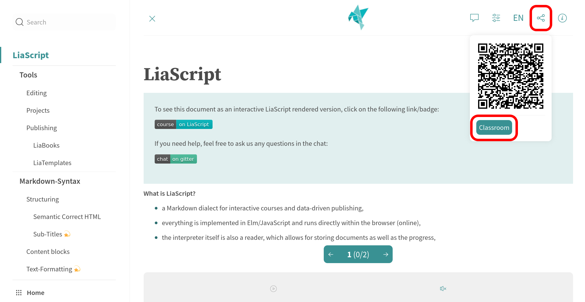
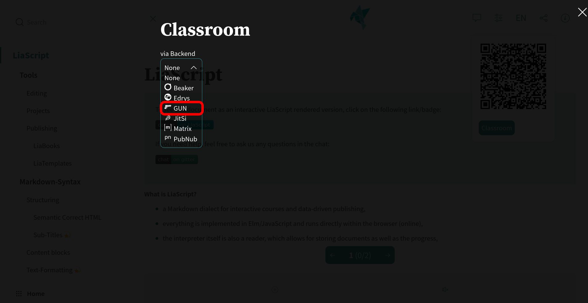
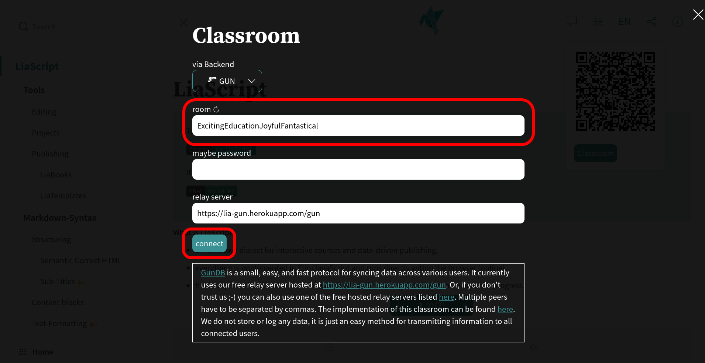
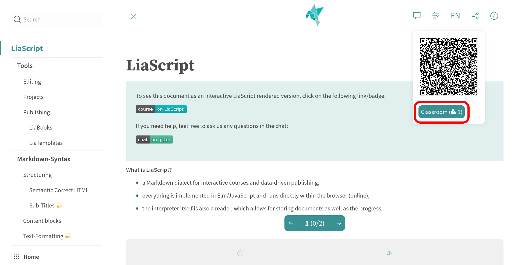
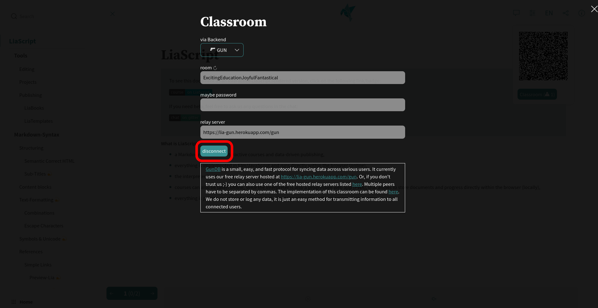

<!--
author:   André Dietrich

email:    LiaScript@web.de

version:  0.0.1

language: en

narrator: US English Female

comment:  Just a demo for quizzes and the classroom feature.

-->

# Quizzes-Surveys-Classrooms

                               --{{0}}--
If you are on the LiaScript website and if you have a course started you can directly switch to the classroom settings by clicking onto the share button.

          {{0-1}}

                               --{{1}}--
When you click onto the classroom button, you should be presented with the classroom settings, where you have to choose one backend service.
We would prefer to use [GunDB](https://gun.eco).
Some services like [Beaker](https://beakerbrowser.com) require you to run your course from another browser or you will have different settings.

          {{1-2}}

                               --{{2}}--
We provide different information for the different services that can be applied.
However, what is similar to all is that you have to define a room name that must be unique.
To help you, you can click onto the circle arrow symbol and a name will be generated randomly for your.
The passwords are optional.

          {{2-3}}

                               --{{3}}--
If you then click onto connect and a connection could be established, the classroom settings will be closed automatically.
Otherwise a error message should be provided.
If everything worked fine you will see, at least one user within the classroom and the URL of your course will have changed.
You can not either share the new URL, which contains all required configurations, or you can send the room name and the password and the course-URL seperately to your peers.
In this case they will have to repeat these steps.

          {{3-4}}

                               --{{4}}--
In order to disconnect, you will have to go to the classroom settings again and click onto the disconnect button.
Again, the URL of the course will change back to the original representation.

           {{4}}

                                 {{3}}
> __Note:__
> You can try this out, if you open LiaScript on different browsers and go back to the quizzes and surveys sections.
> You should experiment a bit the resulting presentations.
> Additionally, try to disconnect and observe the effect on the connected instances.

## Quizzes

> Quizzes in LiaScript are basically visual metaphors.

### Simple-Inputs

What is the name of the Markdown dialect that is used for education?

    [[LiaScript]]

### Single-Choice

Can you think of a simpler way of creating Quizzes?

    [( )] yes
    [(X)] __NO of course not__
    [( )] maybe

### Multiple-Choice

What is the derivative function of $f(x) = x^6$?

    [[ ]] $f'(x) = 6$
    [[X]] $f'(x) = 6x^5$
    [[ ]] $f'(x) = 5x^6$
    [[X]] this is only a random demo to highlight formulas
    ***********************************************************************

    ??[MS-DOS Math Game](https://archive.org/embed/msdos_Super_Solvers_Teasure_MathStorm_1992)

    ***********************************************************************

### German is weird

Man or woman is obvious, but you guess the remaining German grammatical genders?

    [[male (der<!-- class="notranslate"-->)]   (female [die<!-- class="notranslate"-->])   [neuter (das<!-- class="notranslate"-->)]]
    [    [X]           [ ]             [ ]     ]  Mann<!-- class="notranslate"--> - German for man
    [    ( )           (X)             ( )     ]  Frau<!-- class="notranslate"--> - German for woman
    [    [X]           [ ]             [ ]     ]  Junge<!-- class="notranslate"--> - German for boy
    [    ( )           ( )             (X)     ]  Mädchen<!-- class="notranslate"--> - German for girl
    [    [X]           [X]             [ ]     ]  Paprika<!-- class="notranslate"--> - German for bell pepper
    [    (X)           (X)             (X)     ]  Joghurt<!-- class="notranslate"--> - German for yogurt

## Surveys

> Surveys are quizzes without a solution.

### Wordclouds & Text

What do you think about word clouds?

    [[___]]

---

Can you elaborate a bit more on this?

    [[___ ___ ___]]

### What do you think about LiaScript?

Do you like LiaScript so far?

    [(very good)]       __I like it very much__
    [(good)]            It is ok
    [(bad)]             I don't like it
    [(something else)]  I am not sure

Would yo please rate it?

    [(5)] ⭐ ⭐ ⭐ ⭐ ⭐
    [(4)] ⭐ ⭐ ⭐ ⭐
    [(3)] ⭐ ⭐ ⭐
    [(2)] ⭐ ⭐
    [(1)] ⭐

### Where would you improve it?

What features do you use and which not?

[[animations]] Animations
[[TTS]]        Text to speech functionality
[[coding]]     Interactive coding
[[tables]]     Automated visualization of data within tables
[[quizzes]]    Quizzes of course quizzes
[[surveys]]    Yeah, surveys might be interesting too
[[others]]     There are a couple of other features I like...